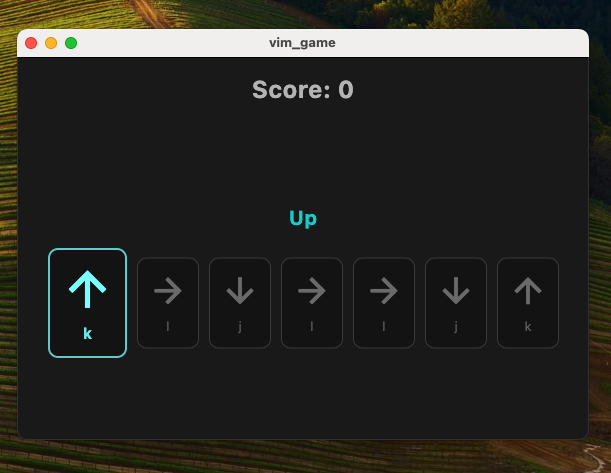

# vim_game

This project serves as a personal learning Code Playground, applying concepts and iterating on features as part of a continuous learning process.

## Project Goals

*   Build muscle memory for navigation and essential editing shortcuts.
*   Practice some flutter concepts
*   Provide a focused, distraction-free practice environment.
*   Explore Flutter desktop development.

## Key Features (MVP Target)

*   Practice mode for basic Vim navigation (`h`, `j`, `k`, `l`).
*   Practice mode for essential Vim commands (e.g., `i`, `dd`, `yw`, `:w`) as used in Zed.
*   Immediate visual feedback for correct/incorrect key presses.
*   Simple scoring system.
*   Minimalist dark theme interface.

## Technology Stack

*   Flutter (Desktop: macOS, Windows, Linux)
*   Dart

## Documentation

This project utilizes documentation to track progress, decisions, and learnings:

*   **Roadmap:** The development plan, outlining the features and phases towards the MVP and beyond, can be found here:
    *   [View Roadmap](DOCS/roadmap.md)
*   **Today I Learned (TIL):** As part of the learning process inherent to this project, insights, discoveries, and solutions to challenges encountered during development are documented in the `Today I Learned` format. These notes capture the practical process to my learning journey.
    *   The template used for TIL entries can be found [here](DOCS/til-template.md).
    *   Individual TIL entries are stored in the `DOCS/` directory following this date format: `dd/mm/yyyy`.
